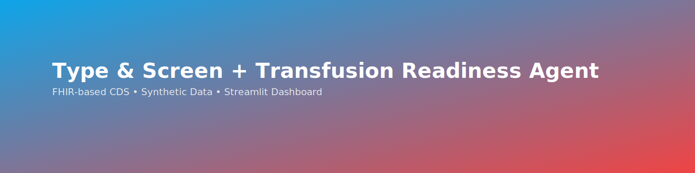

# 🩸 Type & Screen + Transfusion Readiness Agent  
### *FHIR-Based Clinical Decision Support Prototype*




---

## 🧭 Overview
This project demonstrates how **FHIR resources**, **synthetic lab data**, and **Python-based analytics** can enable a *pre-operative Type & Screen readiness alert* and *transfusion readiness dashboard*.

It models how **EHR/LIS integration** (e.g., Cerner + WellSky) could automatically surface **blood-readiness alerts** to clinicians before surgery—supporting safer, faster, and more efficient perioperative workflows.

---

## 🎯 Goals
- Integrate **Type & Screen status**, **specimen validity**, and **blood product readiness** in one FHIR-driven view.  
- Enable **Clinical Decision Support (CDS)** by analyzing `Observation`, `Specimen`, and `ServiceRequest` resources.  
- Improve **Patient Blood Management (PBM)** by preventing same-day transfusion delays.

---

## ⚙️ Architecture


### Workflow Summary
1. **Data generation**  
   - `make_synthetic_type_and_screen.py` → Creates synthetic FHIR Observations (ABO, Rh, Antibody Screen).  
   - `make_synthetic_surgery_requests.py` → Creates FHIR `ServiceRequest` resources for upcoming surgeries.  
2. **Data upload**  
   - `upload_synthetic_type_and_screen.py` and `upload_synthetic_surgery_requests.py` use Azure CLI tokens to POST resources to the FHIR server.  
3. **Alert evaluation**  
   - `evaluate_tns_alerts.py` queries the FHIR endpoint to detect:  
     - ❌ No T&S before surgery  
     - ❌ Latest T&S older than 72 hours pre-op  
4. **Visualization**  
   - Displays results in a Streamlit dashboard for OR or Blood Bank teams.

---

## 🧰 Tech Stack

| Layer | Technology |
|-------|-------------|
| **Language** | Python 3.11 |
| **Frameworks** | Streamlit • Pandas • FHIR-Client |
| **FHIR Server** | Azure Health Data Services FHIR / HAPI-FHIR (local testing) |
| **Data Source** | Synthetic MIMIC-IV FHIR exports (`Observation`, `Specimen`, `ServiceRequest`) |
| **Terminologies** | LOINC (883-9, 10331-7, 890-4) • SNOMED CT (Blood Products) |

---

## 🧪 Example FHIR Resources

**Observation (ABO Group)**

```json
{
  "resourceType": "Observation",
  "code": { "coding": [{ "system": "http://loinc.org", "code": "883-9", "display": "ABO group" }] },
  "valueString": "O",
  "effectiveDateTime": "2025-11-19T08:00:00Z"
}


🏁 Quick Start
# Create and activate a virtual environment (optional)
python -m venv .venv
.venv\Scripts\activate     # (Windows)
source .venv/bin/activate  # (macOS/Linux)

# Install dependencies
pip install -r requirements.txt

# Run key scripts
python scripts/make_synthetic_type_and_screen.py
python scripts/make_synthetic_surgery_requests.py
python scripts/upload_synthetic_type_and_screen.py
python scripts/upload_synthetic_surgery_requests.py
python evaluate_tns_alerts.py

🌟 About This Project

This repository is part of Bonnie K. Shackleford’s applied informatics work, connecting Laboratory Information Systems (LIS) and Electronic Health Records (EHR) using FHIR-based interoperability and AI-ready modeling.
It demonstrates perioperative transfusion readiness logic and clinical decision support concepts aligned with Patient Blood Management (PBM) workflows.

👩‍💻 Author

Bonnie K. Shackleford
Medical Laboratory Scientist • Health Informatics Graduate Student

Bridging LIS & EHR systems with FHIR interoperability and AI-driven clinical decision support.

🔗 LinkedIn
 | 💻 GitHub

📘 License

MIT License © 2025 Bonnie K. Shackleford
Please use this project to improve healthcare interoperability and patient safety — adapt freely with attribution.
